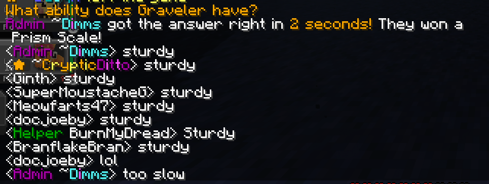

<h1>Trivia - A Fabric 1.19.2 Question & Reward Plugin</h1>

<h3>Originally created for the Roanoke Cobblemon Server to make Cobblemon items more obtainable</h2>

On first run, the plugin will generate a Trivia folder with both questions & rewards JSON files.

Questions/Rewards are added under "pools", which could be treated as categories or "difficulty ranges".

A quiz questionw will be put in chat every 10 minutes, and will timeout if not answered in 2 minutes.



<h3>Upcoming Features</h3>

<li><b>Configuration</b> - quiz interval, timeout, and chat formatting will be made configurable</li>
<li><b>Probability</b> - probabilities will be configurable both on pools & individual questions/rewards</li>
<li><b>Cobblemon Integration</b> - use Cobblemon API to auto generate questions like "What type is this Pokemon", "What's the ability from this description" etc</li>

<h2>Commands</h2>
<li><b>/quizreload [trivia.quizreload]</b> - reload questions & rewards files</li>
<li><b>/quizinterval (seconds) [trivia.quizinterval]</b> - set the amount of time that should pass between questions</li>
<li><b>/quizstart [trivia.quizstart]</b> - force start a quiz, useful for testing questions/rewards</li>

<h2>Questions & Rewards Files</h2>

On first run, these should be generated automatically, you can change them under /config/Trivia/

Both questions & rewards are under "pools", think of these as categories or difficulty types. Questions under the "easy" pool will give rewards from the "easy" pool, but the same could be done for Pokemon vs Minecraft trivia.

<h3>Example questions.json</h3>
```json
{
  "easy": [
    {
      "question": "What type is Bulbasaur?",
      "answers": [
        "Grass",
        "Poison"
      ]
    }
  ],
  "medium": [
    {
      "question": "What ability does Bulbasaur have?",
      "answers": [
        "Overgrow",
        "Chlorophyll"
      ]
    },
    {
      "question": "What ability does Ivysaur have?",
      "answers": [
        "Overgrow",
        "Chlorophyll"
      ]
    }
  ]
}
```

<h3>Example rewards.json</h3>
```json
{
  "easy": [
    {
      "item_name": "cobblemon:dawn_stone",
      "display_name": "Dawn Stone",
      "quantity": 1
    }
  ],
  "medium": [
    {
      "item_name": "cobblemon:link_cable",
      "display_name": "Link Cable",
      "quantity": 1
    },
    {
      "item_name": "cobblemon:dragon_scale",
      "display_name": "Dragon Scale",
      "quantity": 1
    }
  ]
}
```